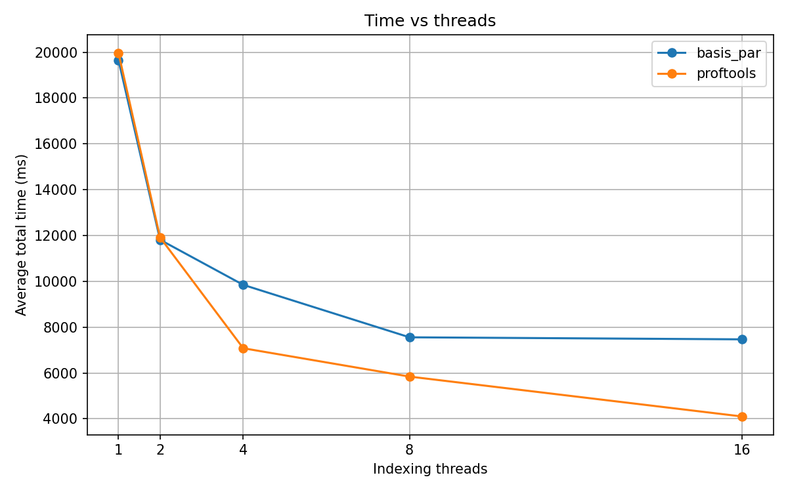

# Порівняння продуктивності із нашою власною реалізацією з попередньої роботи

Created: April 16, 2026 4:47 PM

У цій лабораторній ми використали бібліотеку **Intel Threading Building Blocks (TBB)** для побудови паралельної версії підрахунку слів.

На відміну від попередньої реалізації, де ми застосовували власні thread-safe структури даних і окремий етап об’єднання результатів, тут використовується **потокобезпечна структура даних `concurrent_hash_map`**, яка дозволяє потокам безпосередньо працювати зі спільним словником.

Для порівняння роботи із попередньою лабораторною, ми провели серію запусків із різною кількістю потоків (`1, 2, 4, 8, 16`) та побудували графіки:

- часу виконання,
- прискорення (speedup),
- ефективності (efficiency).

## Час виконання

З графіка видно, що:

- при невеликій кількості потоків (1–2) обидві реалізації працюють майже однаково;
- починаючи з **4 потоків**, нова реалізація (TBB) починає помітно випереджати попередню;
- при **16 потоках**:
    - моя реалізація: ~7500 ms
    - TBB реалізація: ~4100 ms

Тобто нова реалізація працює приблизно **в 1.8 раза швидше**.

Це пояснюється тим, що в новій версії відсутній окремий етап merge, тому що усі **потоки одразу записують результати в одну спільну структуру — `concurrent_hash_map`. А у нашій** попередній версії кожен потік мав свій локальний словник, а потім ці словники потрібно було **зливати (merge)** - > це був окремий етап

## Прискорення (Speedup)

З графіка прискорення:

- у попередній реалізації максимальне прискорення ~ **2.6×**
- у новій реалізації ~ **4.8×** на 16 потоках

Це означає, що використання TBB дозволяє значно краще масштабувати програму при збільшенні кількості потоків. У попередній реалізації після 8 потоків практично не відбувається покращення, тоді як нова версія продовжує масштабуватись.

Отже:

- у попередній реалізації потоки простоюють або витрачають час на синхронізацію,
- у новій реалізації ресурси використовуються значно ефективніше.

Це відбувається знову ж таки тому, що в TBB-версії немає окремого етапу merge і використовується потокобезпечна структура даних, яка зменшує накладні витрати на синхронізацію між потоками. Крім відсутності merge, продуктивність покращується завдяки кращому балансуванню навантаження, меншій кількості блокувань і відсутності зайвого копіювання даних.

- **кращий баланс навантаження** — `tbb::task_group` динамічно розподіляє задачі між потоками, тому менше простоїв;
- **менше блокувань** — `concurrent_hash_map` використовує більш оптимізовану внутрішню синхронізацію, ніж вручну написані рішення;
- **менше копіювання даних** — немає передачі і об’єднання великих словників між потоками;
- **ефективніша робота з чергами** — `concurrent_bounded_queue` краще оптимізована, ніж власноруч структури.

## Ефективність

Ефективність показує, наскільки добре використовуються потоки:

- у нашій попередній реалізації вона падає до ~0.16
- у TBB реалізації вона залишається на рівні ~0.30

Це означає, що:

- у попередній реалізації потоки простоюють або витрачають час на синхронізацію,
- у новій реалізації ресурси використовуються значно ефективніше.

Це узгоджується з попередніми графіками часу виконання та прискорення: TBB-версія краще масштабується зі збільшенням кількості потоків. Іншими словами, при додаванні нових потоків вона втрачає менше продуктивності, ніж наша попередня реалізація.

Такий результат пояснюється тим, що в TBB-версії менше накладних витрат на координацію між потоками, краще збалансоване навантаження і знову ж таки повторюся - немає окремого етапу злиття локальних словників. Тому додаткові потоки дають корисніший внесок у загальне прискорення програми.

## Порівняння максимального часу

Ми також порівняла **найкращий час виконання** для обробки всього набору даних:

- попередня реалізація: ~7500 ms
- нова (TBB): ~4100 ms

Ці значення відповідають конфігураціям із найбільшою кількістю потоків, де обидві реалізації досягають свого максимуму продуктивності.

Таким чином, нова реалізація забезпечує **суттєве зменшення часу обробки** — приблизно на 45%. Це означає, що навіть у найкращому можливому випадку попередня версія поступається новій, а отже різниця між підходами є не випадковою, а системною.

Цей результат добре узгоджується з попередніми графіками: TBB-рішення не лише краще масштабується, а й дозволяє досягти нижчого абсолютного часу виконання для всього набору даних.

## Висновок

- використання сторонніх інструментів (TBB) значно покращує продуктивність;
- усунення етапу merge, на нашу думку, є ключовим фактором прискорення;
- нова реалізація краще масштабується і ефективніше використовує ресурси.

Загалом, TBB-рішення є більш продуктивним, стабільним і простішим з точки зору архітектури порівняно з власною реалізацією.